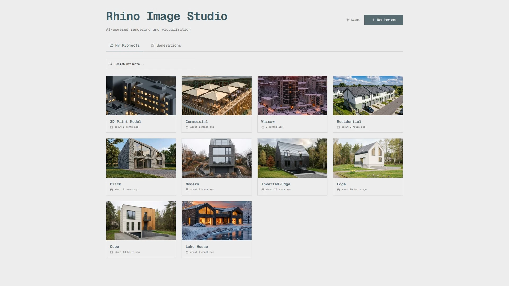
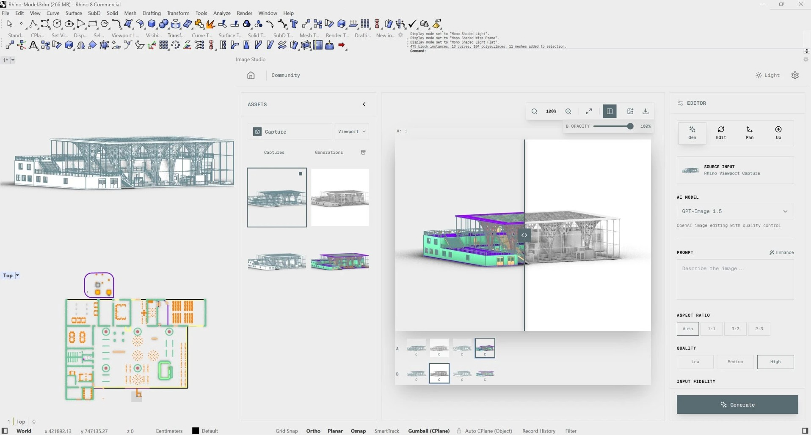
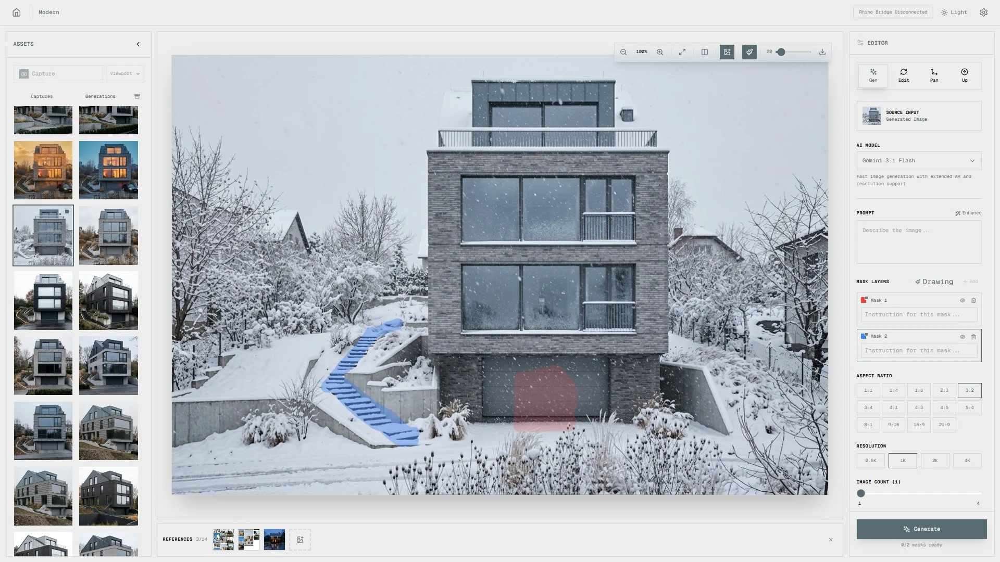
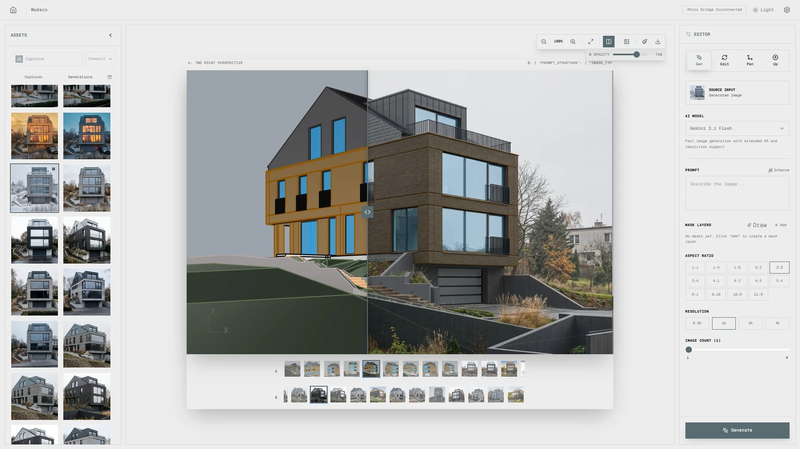

# AI Image Studio

**AI Image Studio** is an advanced **Rhinoceros 8** plugin/workflow that brings generative AI into architectural visualization. Turn simple 3D viewports into photorealistic visualizations, variants and materials in seconds.




## Overview

AI Image Studio is a cross-platform Rhino 8 integration with a shared ASP.NET Core 8 backend and React 18 UI. The product uses platform-specific Rhino plug-in hosts:

- **Windows**: .NET Framework 4.8 plug-in with WebView2 and COM host-object bridge.
- **macOS**: .NET 8 plug-in with a backend-mediated HTTP bridge and browser-hosted UI.

Both platforms share the same backend, database models, API contracts, AI clients and React UI. The plug-in captures the active Rhino viewport, sends it to Google Gemini, fal.ai or OpenAI through a local proxy, and returns photorealistic renders, variations and inpainted edits.

| Captured Rhino viewport | Reference-driven edit |
|---|---|
|  |  |

## Features

- **Text-to-Image / Image-to-Image** — generate visualizations directly from a Rhino viewport (Gemini 3.1 Flash / Gemini 3 Pro).
- **Multi-Mask Inpainting** — edit specific regions of an image with per-mask instructions, using a 2-image colored overlay pipeline.
- **Reference Images** — upload up to 14 references (materials, style, objects) that drive the generation.
- **Pan (Move Camera)** — generate consistent views of the same object from different camera angles (Qwen Multi-Angle).
- **Upscale to 4K** — AI-enhanced upscaling with Topaz Labs models.
- **A/B Compare** — built-in slider to compare Before/After (viewport vs generation, or two generations).
- **Display Mode Selector** — capture in Viewport / Shaded / Rendered / Arctic / Ghosted / Pen modes without switching Rhino's display.
- **Generation Archive** — soft-delete with restore + permanent delete, plus a global gallery on the home page.
- **Local-first** — every project, generation and reference is stored on disk; API keys are encrypted in local OS/user storage and are never committed to config files.



## Documentation

Full documentation lives in [`/docs`](docs/index.md). Polish version: [`docs/pl/`](docs/pl/index.md).

### Users

- **[Getting Started](docs/getting-started.md)** — installation, requirements and configuration.
- **[macOS Plugin Setup](docs/macos.md)** — build, install and smoke-test the Rhino 8 macOS plug-in.
- **[Basics & Workflow](docs/guides/basics.md)** — how to generate images, prompt the model and use AI features.
- **[Troubleshooting](docs/guides/troubleshooting.md)** — fixes for common errors.
- **[Supported AI Models](docs/ai-models.md)** — model list and parameters.

### Engineers & reviewers

- **[Engineering overview](docs/engineering/overview.md)** — architecture narrative for technical interviews and portfolio reviews.
- **[Code quality & audit](docs/engineering/code-quality.md)** — structured audit findings and remediation.
- **[Cross-platform bridge](docs/engineering/cross-platform-bridge.md)** — Windows WebView2 vs macOS HTTP RPC.
- **[System Architecture](docs/api/architecture.md)** — full API reference, DTOs, database.
- **[Contributing](docs/CONTRIBUTING.md)** — development setup and PR process.

## Tech Stack

| Layer | Stack |
|-------|-------|
| Windows Plugin | .NET Framework 4.8, RhinoCommon, Eto.Forms, WebView2 |
| macOS Plugin | .NET 8, RhinoCommon, backend-mediated HTTP bridge |
| Backend | ASP.NET Core 8.0, EF Core + SQLite, Data Protection, Minimal API |
| Frontend | React 18, Vite 5, TypeScript 5.4, Tailwind CSS 3.4, Geist Mono |
| AI providers | Google Gemini API, fal.ai (Seedream, GPT-Image, Qwen, Topaz) |

## Repository Layout

```text
src/
├─ RhinoImageStudio.Backend/           # Shared ASP.NET Core backend and static UI host
├─ RhinoImageStudio.Backend.Tests/     # Unit tests (DisplayModeMapping, FalInputBuilder, …)
├─ RhinoImageStudio.Shared/            # Shared contracts, constants and enums
├─ RhinoImageStudio.UI/                # Shared React UI
├─ RhinoImageStudio.Plugin/            # Windows Rhino 8 plug-in (WebView2)
├─ RhinoImageStudio.Plugin.Mac/        # macOS Rhino 8 plug-in (HTTP bridge)
├─ RhinoImageStudio.Plugin.RhinoCommon/  # Shared RhinoCommon capture & bridge helpers
├─ RhinoImageStudio.sln                # Windows solution
└─ RhinoImageStudio.Mac.sln            # macOS solution
```

See [Engineering documentation](docs/engineering/README.md) for module metrics and architecture narrative.

## Quick Start: Windows Developers

```bash
# 1. Clone the repository
git clone <repo-url>
cd AI-Image-Studio

# 2. Build the frontend (React -> Backend/wwwroot)
cd src/RhinoImageStudio.UI
pnpm install
pnpm run build

# 3. Build backend and Windows plug-in
cd ..
dotnet build RhinoImageStudio.sln
```

Install the Windows plug-in in Rhino through `PlugInManager`:

```text
build\Debug\net48\RhinoImageStudio.rhp
```

Then run:

```text
RhinoImageStudio
```

## Quick Start: macOS Developers

```bash
cd /Users/mateuszbochynski/Developer/AI-Image-Studio

# Build the shared React UI into Backend/wwwroot
cd src/RhinoImageStudio.UI
pnpm install
pnpm run build

# Build and install the macOS Rhino plug-in
cd /Users/mateuszbochynski/Developer/AI-Image-Studio
DOTNET_BIN=/opt/homebrew/opt/dotnet@8/libexec/dotnet \
DOTNET_ROOT=/opt/homebrew/opt/dotnet@8/libexec \
PATH=/opt/homebrew/opt/dotnet@8/libexec:$PATH \
scripts/install-mac-plugin.sh
```

Start Rhino 8:

```bash
open -n "/Applications/Rhino 8.app" --args -nosplash
```

Run these commands in Rhino:

```text
ImageStudioMacStatus
ImageStudioStartBackend
ImageStudioOpen
```

See [Getting Started](docs/getting-started.md) and [macOS Plugin Setup](docs/macos.md) for full setup, smoke tests and API key configuration.

## CI and Release Targets

The repository is intended to stay single-source and cross-platform:

- **Windows CI** builds `src/RhinoImageStudio.sln`.
- **macOS CI** builds `src/RhinoImageStudio.Mac.sln` and validates the self-contained `osx-arm64` backend publish.
- **Frontend CI** builds `src/RhinoImageStudio.UI` and verifies that `Backend/wwwroot` is in sync.

Release packaging should produce separate artifacts from the same commit:

- `RhinoImageStudio-Windows.zip`
- `RhinoImageStudio-macOS-arm64.zip`

## Security Notes

This repository is source-available for noncommercial use. Do not commit API keys, `.env` files, local `appsettings*.json`, SQLite databases, generated captures or private machine-specific configuration. Provider keys must be entered through the application settings UI and stored only in local encrypted storage.

See [Security Policy](SECURITY.md) for reporting and pre-merge checks.

## License

AI Image Studio is licensed under the PolyForm Noncommercial License 1.0.0. Commercial use requires a separate written commercial license from Mateusz Bochyński.

Earlier public versions of the predecessor repository `Bochyn/Rhino-8-Image-Studio` were made available under the MIT License before 2026-06-19. This repository is source-available for noncommercial use. See [LICENSE](LICENSE) for details.
