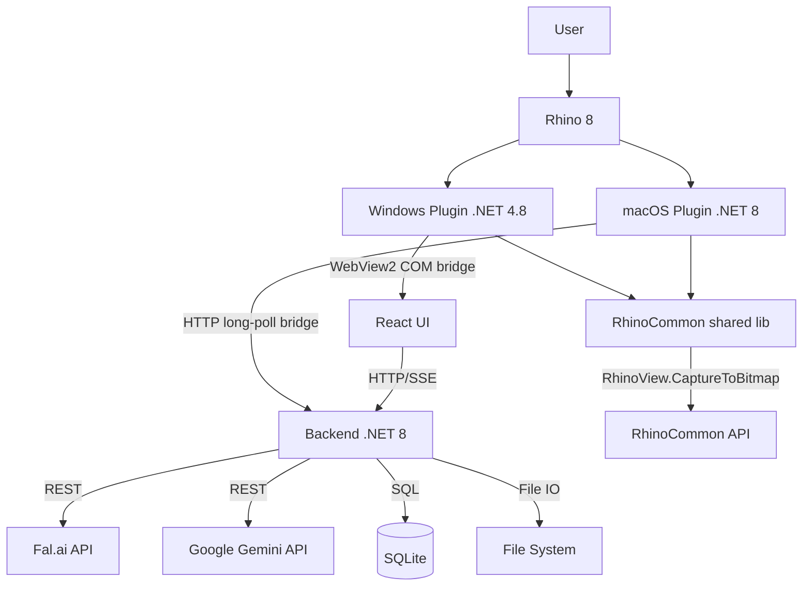

# System Architecture

AI Image Studio is a hybrid system combining a desktop CAD environment with a modern web stack (.NET 8 + React). The Windows and macOS plug-ins share the backend and UI, but use different Rhino bridge implementations.

## Component Diagram



## Component Description

### 0. RhinoCommon Shared Library (`src/RhinoImageStudio.Plugin.RhinoCommon`)

- **Technology**: .NET multi-target (`net48` + `net8.0`), RhinoCommon.
- **Responsibilities**:
  - `ViewportCaptureService` — capture active viewport to PNG bytes.
  - `CaptureUploadClient` — multipart upload to `POST /api/captures`.
  - `RhinoDisplayQueries` — JSON for display modes, viewports, active mode.
  - `RhinoUiThread` — marshal work onto the Rhino UI thread (Windows WebView2).
  - `BackendPortUtilities` — local backend port discovery.

Display mode names use `DisplayModeMapping` in `RhinoImageStudio.Shared` — single map between enums and Rhino English names.

### Official RhinoCommon references

The Rhino-facing implementation is based on these McNeel APIs:

| Area | Official reference | Used in this project |
|------|--------------------|----------------------|
| Namespaces | [RhinoCommon API](https://developer.rhino3d.com/api/rhinocommon/) | `Rhino.Commands`, `Rhino.Display`, `Rhino.PlugIns`, `Rhino.UI` |
| View capture | [Rhino.Display.RhinoView](https://developer.rhino3d.com/api/rhinocommon/rhino.display.rhinoview) | `RhinoView.CaptureToBitmap(Size)` and `RhinoView.CaptureToBitmap(Size, DisplayModeDescription)` |
| UI-thread dispatch | [RhinoApp.InvokeOnUiThread](https://developer.rhino3d.com/api/rhinocommon/rhino.rhinoapp/invokeonuithread) | `RhinoUiThread.RunAsync<T>` |
| Plug-in lifecycle | [Rhino.PlugIns.PlugIn](https://developer.rhino3d.com/api/rhinocommon/rhino.plugins.plugin) | `PlugInLoadTime`, `OnLoad`, command registration |

### 1. Rhino Plugins

#### Windows Plugin (`src/RhinoImageStudio.Plugin`)

- **Technology**: .NET Framework 4.8.
- **Responsibilities**:
  - Registering commands (`ImageStudio`, `ShowImageStudio`, `ImageStudioCapture`).
  - Creating the docked panel.
  - Capturing the viewport (`RhinoView.CaptureToBitmap`).
  - Hosting the React UI through WebView2.

#### Windows RhinoBridge (WebView2 JS Bridge)

The `RhinoBridge` object is exposed to JavaScript through `WebView2.AddHostObjectToScript`. It lets the React UI call Rhino functions from the browser.

| Method | Signature | Description |
|--------|-----------|-------------|
| `GetApiUrl` | `() → string` | Backend URL (`http://localhost:{port}`) |
| `CaptureViewport` | `(sessionId, width, height, displayMode) → string?` | Captures the viewport, uploads to backend, returns captureId. `displayMode = "Current"` uses the current viewport mode (no override). |
| `GetDisplayModes` | `() → string` (JSON) | List of Rhino display modes (name + ID) |
| `GetActiveDisplayMode` | `() → string` | Name of the current display mode of the active viewport |
| `GetViewports` | `() → string` (JSON) | List of viewports (name + isActive) |
| `GetActiveViewportName` | `() → string?` | Name of the active viewport |
| `SetActiveViewport` | `(name) → bool` | Activates a viewport by name |
| `ZoomSelected` | `() → void` | Zoom to selected objects |
| `ZoomExtents` | `() → void` | Zoom to all objects |
| `RunCommand` | `(command) → void` | Scripts a Rhino command through `RhinoApp.RunScript(command, false)`; intended for controlled UI actions. |

Rhino API work is posted through `RhinoUiThread.RunAsync<T>` and `RhinoApp.InvokeOnUiThread`. The WebView2 host-object methods remain synchronous at the JavaScript boundary, so the implementation blocks on completed tasks with `.GetAwaiter().GetResult()` after queuing Rhino work.

Implementation delegates capture to `RhinoImageStudio.Plugin.RhinoCommon.ViewportCaptureService`.

#### macOS Plugin (`src/RhinoImageStudio.Plugin.Mac`)

- **Technology**: .NET 8 Rhino plug-in.
- **Commands**:
  - `ImageStudioMacStatus` — verifies that the plug-in loaded and writes a status marker.
  - `ImageStudioStartBackend` — starts or connects to the backend sidecar.
  - `ImageStudioOpen` — starts the backend if needed and opens the UI in the system browser.
- **Responsibilities**:
  - Registering macOS Rhino commands.
  - Starting the self-contained backend sidecar from the installed `.rhp` bundle.
  - Maintaining the HTTP bridge client from Rhino to the backend.
  - Capturing the active viewport on the Rhino UI thread.

macOS does not support the Windows WebView2/COM bridge. The macOS path replaces `AddHostObjectToScript` with a **backend-mediated, token-authenticated** bridge:

1. React calls HTTP endpoints under `/api/rhino/*` (or uses explicit HTTP bridge in `rhino.ts`).
2. `RhinoBridgeService` queues work items (bounded channel, max 10).
3. `MacRhinoBridgeClient` long-polls `GET /api/rhino/bridge/next` with header `X-Rhino-Bridge-Token`.
4. The plug-in executes viewport capture on the Rhino UI thread; display/query RPCs currently call the shared RhinoCommon query helpers directly.
5. Results are posted to `POST /api/rhino/bridge/{requestId}/complete`.
6. Captures are uploaded through `CaptureUploadClient` → `/api/captures`.

Bridge token is stored under the current user's local application data directory in `RhinoImageStudio/bridge.token` (see [Security model](../engineering/security.md)).

### 2. Backend (`src/RhinoImageStudio.Backend`)
- **Technology**: ASP.NET Core 8.0.
- **Role**: The "brain" of operations, independent of Rhino.
- **Responsibilities**:
  - Serving the UI static files (React).
  - Proxying the fal.ai API (hiding the API key).
  - Job queueing.
  - Database (Entity Framework + SQLite) — session and prompt history.

#### Backend structure

- `Program.cs` — slim bootstrap (middleware, endpoint mapping).
- `Infrastructure/` — `DatabaseInitializer`, `ServiceCollectionExtensions`.
- `Endpoints/` — feature-grouped Minimal API (`Capture`, `Config`, `Events`, `Generation`, `Image`, `Job`, `Project`, `RhinoBridge`).
- `Validation/` — request validators (`GenerateRequestValidator`, `JobRequestValidators`, `ProjectValidator`).
- `Services/` — `JobProcessor`, `ConfigService`, generation query/debug/mask services, `FalModelResolver`, etc.
- `MappingExtensions.cs` — model → DTO mapping.
#### Key technical improvements

- **SSE pub/sub**: each subscriber gets its own channel (no "lost" events with multiple clients).
- **HttpClient lifecycle**: image downloads use `IHttpClientFactory` (`ImageDownloader`).
- **Resilience**: HTTP clients use `AddStandardResilienceHandler()`.
- **PromptBuilder** + **FalInputBuilder**: shared prompt / fal payload construction.
- **JobProcessor**: Gemini + fal models; `ProviderModelId` stored for fal cancel routing.
- **Storage security**: path traversal protection in `GetAbsolutePath()`.
- **Secret storage**: `DataProtectionSecretStorage` with DPAPI legacy migration on Windows.
- **Rhino bridge**: token-authenticated queue + real RPC (display modes, viewports, capture).
- **RhinoCommon**: shared capture/upload between Windows and macOS plugins.

### 3. Frontend UI (`src/RhinoImageStudio.UI`)
- **Technology**: React 18, Vite 6, TypeScript 5.4, Tailwind CSS 3.4.
- **Package manager**: pnpm (with `node-linker=hoisted`).
- **Typography**: Geist Mono (the only font — monospace, hierarchy via weights and sizes).
- **Responsibilities**:
  - User interface.
  - Progress visualization.
  - Parameter editors.

## Design System

### Mono-Theme

The app uses an achromatic Mono-Theme palette with a teal accent. A sharp, technical style (zero border-radius, monospace font). Full Light/Dark mode support.

### Color Palette

| Token | Light Mode | Dark Mode | Usage |
|-------|------------|-----------|-------|
| `text` | `#0F0F0F` | `#D1D1D1` | Primary text |
| `background` | `#ededed` | `#262626` | App background |
| `primary` | `#586B71` | `#90A3A9` | Headings, CTA (Teal) |
| `secondary` | `#757575` | `#999999` | Secondary text |
| `accent` | `#0F0F0F` | `#D1D1D1` | Accents (high contrast) |
| `panel-bg` | `#ededed` | `#2C2C2C` | Side panels |
| `card-bg` | `#ededed` | `#2C2C2C` | Cards, overlays |
| `card-hover` | `#E5E5E5` | `#363636` | Card hover |
| `border` | `#D6D6D6` | `#353535` | Borders |
| `danger` | `#757575` | `#999999` | Destructive actions (achromatic) |
| `success` | `#757575` | `#999999` | Success (achromatic) |
| `warning` | `#757575` | `#999999` | Warnings (achromatic) |
| `info` | `#586B71` | `#90A3A9` | System info (teal) |

Extra utility tokens: `--radius: 0rem` (sharp edges, zero rounding).

### Typography

**Font:** Geist Mono (weights 100–900, variable font)
**CSS variable:** `--font-sans: 'Geist Mono', ui-monospace, monospace`
**Hierarchy:** font-weight + font-size (monospace, no font mixing)

| Size | Value |
|------|-------|
| `micro` / `xs` | 0.625rem |
| `sm` | 0.750rem |
| `base` | 1rem |
| `lg` | 1.125rem |
| `xl` | 1.333rem |
| `2xl` | 1.777rem |
| `3xl` | 2.369rem |
| `4xl` | 3.158rem |
| `5xl` | 4.210rem |

### Usage in Code

```tsx
// Tailwind classes (Mono-Theme)
<div className="bg-background text-text border-border">
<button className="bg-primary text-background hover:bg-primary/90">
  CTA Button
</button>
<div className="bg-card hover:bg-card-hover">Card</div>
```

Full spec in the Design System section above.

## AI Model Configuration

Every AI model has its own configuration of available options. The system is **model-aware** — the UI automatically adapts the available options to the chosen model.

### Configuration shape (`models.ts`)

```typescript
interface ModelInfo {
  id: string;                          // Model ID (e.g. "gemini-3.1-flash-image-preview")
  provider: 'fal' | 'gemini';          // API provider
  name: string;                        // Full display name
  shortName: string;                   // Short name (e.g. "gemini-flash")
  description: string;                 // Model description
  capabilities: ModelCapabilities;     // Supported feature flags
  aspectRatios?: AspectRatioOption[];  // Available aspect ratios
  resolutions?: ResolutionOption[];    // Available resolutions
  maxReferences?: number;              // Max reference images
  maxMaskLayers?: number;              // Max mask layers
  maxTotalImages?: number;             // Max images per request (source + overlay + refs)
  qualityOptions?: { value: string; label: string }[];   // Quality options (GPT-Image)
  fidelityOptions?: { value: string; label: string }[];  // Fidelity options (GPT-Image)
}

interface ModelCapabilities {
  supportsNegativePrompt: boolean;
  supportsSeed: boolean;
  supportsAspectRatio: boolean;
  supportsNumImages: boolean;
  supportsStrength: boolean;           // Image-to-image / refine
  supportsReferences: boolean;         // Reference images
  supportsMasks: boolean;              // Inpainting masks
}
```

### Available Models

| Model | Provider | Resolutions | AR | References | Masks | Default for |
|-------|----------|-------------|-----|------------|-------|-------------|
| **Gemini 3.1 Flash** | Gemini | 0.5K, 1K, 2K, 4K | 14 ratios (extended) | Max 14 | Max 2 | Generate, Refine |
| **Gemini 3 Pro** | Gemini | 1K, 2K, 4K | 10 ratios (standard) | Max 11 | Max 8 | – |
| **Seedream v5 Lite** | fal.ai | Auto 2K/3K + presets | 8 presets | Max 9 | – | – |
| **GPT-Image 1.5** | fal.ai | Pixel-based | 4 options | Max 4 | – | – |
| **GPT Image 2** | fal.ai | Presets | 7 options | Max 4 | – | – |
| **Qwen Multi-Angle** | fal.ai | – | – | – | – | Multi-angle |
| **Topaz Upscale** | fal.ai | – | – | – | – | Upscale |

**Gemini 3.1 Flash** (`gemini-3.1-flash-image-preview`) — default model (cheaper, faster). Supports extended aspect ratios (including 1:4, 1:8, 4:1, 8:1) and resolutions from 0.5K to 4K. Max 16 images per request.
**Gemini 3 Pro** (`gemini-3-pro-image-preview`) — higher quality, standard AR (10 ratios). Max 14 images per request.
**Seedream v5 Lite** (`fal-ai/bytedance/seedream/v5/lite/edit`) — ByteDance, image editing up to 3K. Supports references (max 9), size presets (Auto 2K/3K, square, portrait, landscape).
**GPT-Image 1.5** (`fal-ai/gpt-image-1.5/edit`) — OpenAI, editing with quality/fidelity controls. Supports references (max 4), pixel-based sizes (1024x1024, 1536x1024, 1024x1536).
**GPT Image 2** (`openai/gpt-image-2/edit`) — OpenAI image editing route through fal.ai. Supports references (max 4), quality control and image-size presets.

> **Note:** The backend (`GeminiClient.cs`) gates the `imageSize` parameter — sent only for Pro models. Flash doesn't support this parameter.

### Reference Images

Four models (Gemini 3.1 Flash, Gemini 3 Pro, Seedream v5 Lite, GPT-Image 1.5) support **reference images** — additional images uploaded from disk that the AI uses as visual context (e.g. materials, objects, style).

- Upload: `POST /api/projects/{projectId}/references` (multipart, max 10 MB/file)
- List: `GET /api/projects/{projectId}/references`
- Delete: `DELETE /api/references/{id}`
- Limit: max 10 MB per file; per-model caps come from `maxReferences` in `models.ts`
- Transport: as `inline_data` parts[] in Gemini API requests; as `image_url` in fal.ai requests
- UI: panel below the canvas with thumbnails, visible only for models that support references

### Viewport Capture Synchronization

Capture automatically uses dimensions matching the editor settings:
- `InspectorPanel` → AR/Resolution settings → `StudioPage` → `handleCapture()`
- `calculateDimensions()` derives pixels from AR and Resolution

## Data Flow

1. **Capture**: Plugin captures the bitmap (dimensions from AR/Resolution) → POSTs to Backend.
2. **Job**: Backend creates a job, saves the image to disk, adds a DB record.
3. **Generate**: Backend sends the request to fal.ai/Gemini. Frontend polls (or receives SSE) for status.
4. **Result**: API returns an image URL → Backend downloads and stores it locally → Frontend displays it.

## API Endpoints (full list)

All endpoints sit under the `/api` prefix (except `/images/` and the SPA fallback).

### Projects

| Method | Endpoint | Description |
|--------|----------|-------------|
| GET | `/api/projects` | List projects (sorted: pinned, updatedAt) |
| GET | `/api/projects/{id}` | Project details |
| POST | `/api/projects` | Create project (`CreateProjectRequest`) |
| PUT | `/api/projects/{id}` | Update project (`UpdateProjectRequest`) |
| DELETE | `/api/projects/{id}` | Delete project (cascade: captures, generations, references + files) |

### Captures

| Method | Endpoint | Description |
|--------|----------|-------------|
| GET | `/api/projects/{projectId}/captures` | List project captures |
| POST | `/api/captures` | Upload capture (multipart: image, projectId, width, height, displayMode, viewName) |
| DELETE | `/api/captures/{id}` | Delete capture (+ files) |

### Rhino Bridge

These endpoints support the macOS backend-mediated Rhino bridge. The React HTTP bridge (`rhino.ts`) uses the same routes when WebView2 is unavailable.

| Method | Endpoint | Description |
|--------|----------|-------------|
| GET | `/api/rhino/status` | Bridge status (`connected`, `lastSeenUtc`) |
| GET | `/api/rhino/display-modes` | Display modes from Rhino (RPC; 503 if disconnected) |
| GET | `/api/rhino/viewports` | Viewport list from Rhino |
| GET | `/api/rhino/active-display-mode` | Active viewport display mode |
| POST | `/api/rhino/capture` | Queue capture → returns `captureId` |
| GET | `/api/rhino/bridge/next` | Plugin long-poll (requires `X-Rhino-Bridge-Token`) |
| POST | `/api/rhino/bridge/{requestId}/complete` | Plugin completes work item (token required) |

See [Cross-platform bridge](../engineering/cross-platform-bridge.md).

### Generations

| Method | Endpoint | Description |
|--------|----------|-------------|
| GET | `/api/projects/{projectId}/generations` | List active generations (no archived) |
| GET | `/api/projects/{projectId}/generations/archived` | List archived generations |
| GET | `/api/generations` | Global list (`?limit=50&offset=0`) |
| GET | `/api/generations/{id}` | Generation details |

### Archiving

| Method | Endpoint | Description |
|--------|----------|-------------|
| DELETE | `/api/generations/{id}` | Archive (soft-delete: IsArchived=true) |
| PUT | `/api/generations/{id}/restore` | Restore from archive |
| DELETE | `/api/generations/{id}/permanent` | Permanent delete (requires archived, removes files + record) |

### Diagnostics

| Method | Endpoint | Description |
|--------|----------|-------------|
| GET | `/api/generations/{id}/debug` | Debug info (sanitized request, augmented prompt, masks as size) |
| GET | `/api/generations/{id}/masks` | Mask data (full base64 PNG + instructions from Job.RequestJson) |
| GET | `/api/generations/{id}/masks/overlay` | Overlay image (binary PNG — colored mask overlay) |
| GET | `/api/generations/{id}/masks/{index}/image` | Single B&W mask (binary PNG, legacy format) |

### References

| Method | Endpoint | Description |
|--------|----------|-------------|
| GET | `/api/projects/{projectId}/references` | List project references |
| POST | `/api/projects/{projectId}/references` | Upload reference (multipart: image, max 10 MB, max 4/project) |
| DELETE | `/api/references/{id}` | Delete reference (+ files) |

### Pipeline (AI actions)

| Method | Endpoint | Description |
|--------|----------|-------------|
| POST | `/api/generate` | Image generation (`GenerateRequest` — with masks/references) |
| POST | `/api/refine` | Refinement (`RefineRequest`) |
| POST | `/api/multi-angle` | Multi-angle Qwen (`MultiAngleRequest`) |
| POST | `/api/upscale` | Upscale Topaz (`UpscaleRequest`) |

All return `202 Accepted` with a `JobDto`.

### Jobs

| Method | Endpoint | Description |
|--------|----------|-------------|
| GET | `/api/projects/{projectId}/jobs` | List project jobs |
| POST | `/api/jobs/{id}/cancel` | Cancel a job (tries fal.ai cancel, marks Canceled) |

### Config

| Method | Endpoint | Description |
|--------|----------|-------------|
| GET | `/api/bootstrap` | Localhost session token for UI (`X-Rhino-Bridge-Token` on mutating routes) |
| GET | `/api/config` | Current configuration (`ConfigDto`) |
| POST | `/api/config/gemini-api-key` | Set Gemini key (`SetGeminiApiKeyRequest`) — requires local token |
| POST | `/api/config/fal-api-key` | Set fal.ai key (`SetFalApiKeyRequest`) — requires local token |
| POST | `/api/config/verify-gemini-key` | Verify the Gemini API key via `x-goog-api-key` header |
| DELETE | `/api/config/secrets/gemini` | Remove the Gemini API key from encrypted storage |
| DELETE | `/api/config/secrets/fal` | Remove the fal.ai API key from encrypted storage |

> Mutating config routes require `X-Rhino-Bridge-Token`. The UI obtains the token from `GET /api/bootstrap` (macOS browser / Vite dev) or `window.__RHINO_LOCAL_TOKEN` (WebView2 injection).

### Events (SSE)

| Method | Endpoint | Description |
|--------|----------|-------------|
| GET | `/api/events` | Global SSE stream (all events, per-subscriber channel) |
| GET | `/api/projects/{projectId}/events` | SSE stream filtered by project (per-subscriber channel) |

Content-Type: `text/event-stream`. Data sent as JSON in `data: {...}\n\n` format.

### Other

| Method | Endpoint | Description |
|--------|----------|-------------|
| GET | `/api/health` | Health check (`HealthResponse`: `status`, `timestamp`) |
| GET | `/images/{**path}` | Serves static files (captures, thumbnails, generations) |

### Main Contracts (DTOs)

Contracts defined in `src/RhinoImageStudio.Shared/Contracts/Contracts.cs`.

#### GenerateRequest (most important — handles masks and references)

```typescript
{
  projectId: Guid;
  prompt: string;
  sourceCaptureId?: Guid;
  parentGenerationId?: Guid;
  model?: string;              // "gemini-3.1-flash-image-preview" | "gemini-3-pro-image-preview" | "openai/gpt-image-2/edit" | "fal-ai/bytedance/seedream/v5/lite/edit" | "fal-ai/gpt-image-1.5/edit"
  aspectRatio?: string;        // "1:1", "16:9", ...
  resolution?: string;         // "1K", "2K", "4K"
  numImages: number;           // default 1
  outputFormat?: string;       // "png" | "jpeg"
  referenceImageIds?: Guid[];
  maskLayers?: MaskLayerData[];     // legacy B&W format
  maskPayload?: MaskPayloadData;    // new overlay format
  quality?: string;                 // quality (GPT-Image: "low" | "medium" | "high")
  inputFidelity?: string;           // fidelity (GPT-Image: "low" | "medium" | "high")
}

// MaskPayloadData (overlay):
{ overlayImageBase64: string; layers: MaskOverlayLayerData[] }
// MaskOverlayLayerData:
{ color: string; colorName: string; instruction: string }
// MaskLayerData (legacy):
{ maskImageBase64: string; instruction: string }
```

#### GenerationDto (response — generation data)

```typescript
{
  id: Guid;
  projectId: Guid;
  parentGenerationId?: Guid;
  sourceCaptureId?: Guid;
  stage: JobType;              // Generate | Refine | MultiAngle | Upscale
  prompt?: string;
  imageUrl?: string;
  thumbnailUrl?: string;
  width?: number;
  height?: number;
  azimuth?: number;
  elevation?: number;
  zoom?: number;
  modelId?: string;
  parametersJson?: string;     // JSON: {"aspectRatio":"16:9","resolution":"1K",...}
  createdAt: DateTime;
  isArchived: boolean;
  archivedAt?: DateTime;
  projectName?: string;        // project name (available in GET /api/generations)
}
```

#### ProjectDto

```typescript
{
  id: Guid;
  name: string;
  description?: string;
  createdAt: DateTime;
  updatedAt: DateTime;
  isPinned: boolean;
  captureCount: number;
  generationCount: number;     // active only (no archived)
  lastThumbnailUrl?: string;
}
```

#### HealthResponse

```typescript
{
  status: string;
  timestamp: DateTime;
}
```

#### CaptureDto

```typescript
{
  id: Guid;
  projectId: Guid;
  imageUrl: string;
  thumbnailUrl?: string;
  width: number;
  height: number;
  displayMode: DisplayMode;    // mode used at capture time (e.g. Shaded, Rendered)
  viewName?: string;
  createdAt: DateTime;
}
```

#### JobDto + JobProgressEvent

```typescript
// JobDto (job state):
{
  id: Guid;
  projectId: Guid;
  type: JobType;               // Generate | Refine | MultiAngle | Upscale
  status: JobStatus;           // Queued | Running | Succeeded | Failed | Canceled
  progress: number;            // 0-100
  progressMessage?: string;
  errorMessage?: string;
  resultId?: Guid;             // generation ID after completion
  createdAt: DateTime;
  startedAt?: DateTime;
  completedAt?: DateTime;
}

// JobProgressEvent (SSE event):
{
  jobId: Guid;
  status: JobStatus;
  progress: number;
  message?: string;
  resultId?: Guid;
}
```

#### ConfigDto

```typescript
{
  hasFalApiKey: boolean;
  hasGeminiApiKey: boolean;
  dataPath: string;
  backendPort: number;
  defaultProvider: string;     // "gemini" | "fal"
}
```

## Database Structure

Data is stored in SQLite via Entity Framework Core. Database file: `%LOCALAPPDATA%/RhinoImageStudio/data/rhinoimagestudio.db`.

### Tables

| Table | Columns | Description |
|-------|---------|-------------|
| **Projects** | `Id`, `Name`, `IsPinned`, `CreatedAt`, `UpdatedAt` | User work container |
| **Captures** | `Id`, `ProjectId`, `FilePath`, `ThumbnailPath`, `Width`, `Height`, `DisplayMode`, `ViewName`, `CreatedAt`, `CameraPosition`, `CameraTarget`, `CameraLens` | Captured Rhino viewport image |
| **Generations** | `Id`, `ProjectId`, `ParentGenerationId`, `SourceCaptureId`, `Stage`, `Prompt`, `NegativePrompt`, `ParametersJson`, `FilePath`, `ThumbnailPath`, `Width`, `Height`, `Seed`, `Azimuth`, `Elevation`, `Zoom`, `FalRequestId`, `ModelId`, `IsArchived`, `ArchivedAt`, `CreatedAt` | AI operation result (soft-delete via `IsArchived`) |
| **ReferenceImages** | `Id`, `ProjectId`, `OriginalFileName`, `FilePath`, `ThumbnailPath`, `CreatedAt` | User-uploaded reference images |
| **Jobs** | `Id`, `ProjectId`, `Type`, `Status`, `Progress`, `ResultGenerationId`, `ProviderModelId`, `ErrorMessage`, `CreatedAt`, `CompletedAt`, `ParametersJson` | Job in the processing queue |

A composite index `(ProjectId, IsArchived)` on the Generations table optimizes filtering active vs archived generations.

## Frontend API Client (UI)

The frontend uses a centralized `api.ts` client with an `apiError()` parser that reads `error/message/details` from backend responses and forwards them to UI toasts.

Key changes after refactoring:
- The projects client maps `ProjectDto.lastThumbnailUrl` to the preview field used on cards.
- The `useJobs` hook loads initial state via `GET /api/projects/{projectId}/jobs` (instead of raw `fetch`).
- Studio item selection is typed as a discriminated union (`SelectedItem`) instead of duck-typed.

Main entities:
- **Project**: User work container.
- **Capture**: Captured Rhino viewport image.
- **Generation**: A single AI operation (Prompt + Parameters + Result). Fields `IsArchived` (bool) and `ArchivedAt` (DateTime?) handle soft-delete.
- **ReferenceImage**: User-uploaded reference image (max 4/project).
- **Job**: Job in the processing queue (Generate, Refine, MultiAngle, Upscale).

### Generation Archiving

Generations support soft-delete (archiving) — they aren't permanently removed, but flagged with `IsArchived = true`. List endpoints automatically filter archived entries. Permanent removal (with files) requires prior archiving.

A composite index `(ProjectId, IsArchived)` optimizes filter queries.

### Archiving Endpoints

| Endpoint | Method | Description |
|----------|--------|-------------|
| `DELETE /api/generations/{id}` | Soft-delete | IsArchived=true, ArchivedAt=now |
| `PUT /api/generations/{id}/restore` | Restore | IsArchived=false, ArchivedAt=null |
| `DELETE /api/generations/{id}/permanent` | Hard-delete | Requires archived, removes files + record |
| `GET /api/projects/{id}/generations/archived` | List | Archived only, sorted by ArchivedAt |

### Diagnostic Endpoints

The `/debug` endpoint returns simplified data (masks shown as `[PNG, ~XKB]`). The `/masks` endpoint returns full base64 PNGs — used for reconstructing masks on the canvas.
