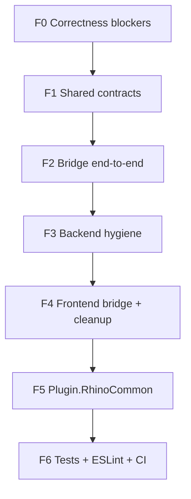

# Code Quality & Audit

This document summarizes a **structured code audit** of Rhino Image Studio and the remediation work that followed. It is written for reviewers who want to understand code health, technical debt, and engineering maturity — not as a raw implementation checklist.

Raw planning notes remain in `docs/plans/` for historical reference.

## Executive summary

| Area | Before audit | After remediation (PR #22) |
|------|--------------|------------------------------|
| Backend structure | 1000+ line `Program.cs`, mixed concerns | Slim bootstrap + `Endpoints/` + `Infrastructure/` |
| SSE events | Single channel — only one client received events | Per-subscriber channels (proper pub/sub) |
| macOS bridge | Unauthenticated queue; stub display data | Token auth + real Rhino RPC |
| Plugin capture | Duplicated Win/Mac `ViewportCaptureService` | Shared `Plugin.RhinoCommon` |
| Secrets | DPAPI-only; macOS incompatible; migration gap | Data Protection + DPAPI dual-read on Windows |
| Job processing | Inconsistent fal payloads; wrong cancel routing | `FalInputBuilder`, `ProviderModelId` on jobs |
| Frontend bridge | Silent HTTP fallback; double JSON parsing | Explicit WebView2 vs HTTP detection |
| Tests & lint | None | xUnit backend tests, ESLint, CI jobs |

**Scale:** ~13,000 lines of application source across 6 projects (see [engineering README](README.md)).

## Audit scope

Two parallel audits were performed in February 2026:

| Audit | Scope | Focus |
|-------|-------|-------|
| **Backend** | `RhinoImageStudio.Backend`, `Shared` | Security, SSE, god classes, HttpClient lifecycle, storage |
| **Frontend** | `RhinoImageStudio.UI` | Types vs API contract, component size, UX/a11y gaps |

Thermos branch review (macOS feature branch) identified additional **merge blockers**: bridge security, contract lies between platforms, UI-thread races on Windows.

## Critical findings (and fixes)

### Security

| Finding | Risk | Resolution |
|---------|------|------------|
| Path traversal in `/images/{**path}` | Read arbitrary files if storage root escaped | `GetAbsolutePath()` validates resolved path stays under root |
| Open bridge poll/complete endpoints | Any localhost process could dequeue or spoof Rhino work | `BridgeTokenService` + `X-Rhino-Bridge-Token` header |
| DPAPI secrets on .NET 8 / macOS | `HasSecret` true but `GetSecret` null after storage swap | Dual-read migration in `DataProtectionSecretStorage` |
| API keys in repo | Credential leak | Documented in SECURITY.md; UI-only entry |

### Correctness

| Finding | Impact | Resolution |
|---------|--------|------------|
| SSE single-reader channel | Second UI tab never got job progress | `EventBroadcaster` writes to all subscriber channels |
| `promptToSend` ignored in fal payloads | Weaker/ref wrong prompts for fal models | `FalInputBuilder` uses augmented prompt |
| Cancel used wrong model id | fal jobs not cancelled on server | `Job.ProviderModelId` persisted at enqueue |
| macOS stub bridge endpoints | UI showed fake display modes | RPC to real `RhinoDisplayQueries` |
| Windows `InvokeOnUiThread` + `.Result` | UI thread deadlock risk | `RhinoUiThread.RunAsync<T>` with TCS |

### Maintainability

| Finding | Impact | Resolution |
|---------|--------|------------|
| Display mode mapping in 4+ places | Drift between Win/Mac/backend | `DisplayModeMapping` in Shared |
| Duplicate capture/upload code | Double bug fixes | `Plugin.RhinoCommon` |
| Mask validation copied in endpoints | Inconsistent limits | `GenerateRequestValidator` |
| JSON options inconsistent | Subtle deserialization bugs | `JobRequestJson` shared options |

## Backend audit — category scores (before)

| Category | Score | Notes |
|----------|-------|-------|
| Architecture | 6/10 | Good separation started; `JobProcessor` still large |
| Security | 5/10 | Path traversal fixed early; bridge open until refactor |
| Async / concurrency | 6/10 | SSE fixed; bridge queue bounded (cap 10) |
| Error handling | 6/10 | Structured `{ error }` responses; client now parses them |
| Testability | 3/10 | Improved — extractors testable without ASP.NET host |

## Frontend audit — category scores (before)

| Category | Score | Notes |
|----------|-------|-------|
| Component architecture | 7/10 | `StudioPage` still a god component — follow-up |
| FE ↔ BE contract | 6/10 | PascalCase job enums; phantom `Generation.status` removed in places |
| Design system | 6/10 | Mono-theme consistent; micro-typography debt |
| Accessibility | 3/10 | Dialog a11y hook exists; full pass still open |
| Performance | 6/10 | Lazy modals; mask canvas is the hot path |

Full itemized lists: `docs/plans/2026-02-17-backend-code-audit.md`, `docs/plans/2026-02-17-frontend-code-audit.md`.

## Refactor phases (executed)

| Phase | Deliverables |
|-------|--------------|
| **F0** | Secret migration, bridge token, JobProcessor fixes |
| **F1** | `RhinoBridgeContracts`, `DisplayModeMapping`, `SecretKeyNames` |
| **F2** | RPC queue, `rhino.ts`, Windows `RhinoUiThread` |
| **F3** | `FalInputBuilder`, validators, `ServiceCollectionExtensions` |
| **F4** | Typed bridge, removed `sse.ts` / `useSession.ts` dead code |
| **F5** | `RhinoImageStudio.Plugin.RhinoCommon` project |
| **F6** | `Backend.Tests`, ESLint, `dotnet test` in CI |

## Quality gates today

| Gate | Command / location |
|------|-------------------|
| Backend build (Windows) | `dotnet build src/RhinoImageStudio.sln` |
| Backend build (macOS) | `dotnet build src/RhinoImageStudio.Mac.sln` |
| Unit tests | `dotnet test src/RhinoImageStudio.Backend.Tests` |
| Typecheck + build UI | `pnpm --dir src/RhinoImageStudio.UI run build` |
| Lint UI | `pnpm --dir src/RhinoImageStudio.UI run lint` |
| wwwroot in sync | CI `git diff` on `Backend/wwwroot` |
| Secret scan | `SECURITY.md` candidate-file `rg` recipe |

## Remaining technical debt (honest backlog)

Transparency matters for senior reviews. These items are **known** and documented:

| Item | Priority | Notes |
|------|----------|-------|
| Split `InspectorPanel` / `StudioPage` | Medium | Largest frontend components |
| Expand test coverage | Medium | Bridge service, validator edge cases |
| Accessibility pass | Medium | Focus trap, aria labels, contrast |
| `MediaCleanup` wiring | Low | Helper exists; not all delete paths use it |
| Inspector `any` types (9 ESLint warnings) | Low | Narrow to `GeneratePayload` union |
| macOS `MacOpenStudioCommand` sync-over-async | Low | Prefer async command pattern |

## How to cite this in a portfolio or CV

> Built a cross-platform Rhino 8 AI plugin (.NET + React) with a custom macOS HTTP bridge, local job queue, and Gemini/fal.ai integration. Led a structured code audit: fixed SSE pub/sub, secured the bridge, extracted shared RhinoCommon library, added tests and CI — ~13k LOC, 6 projects.

Link reviewers to:

1. [Project overview](overview.md) — narrative
2. [Cross-platform bridge](cross-platform-bridge.md) — deepest technical story
3. Pull request `#22` on GitHub — concrete diff
