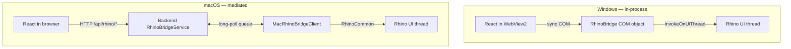
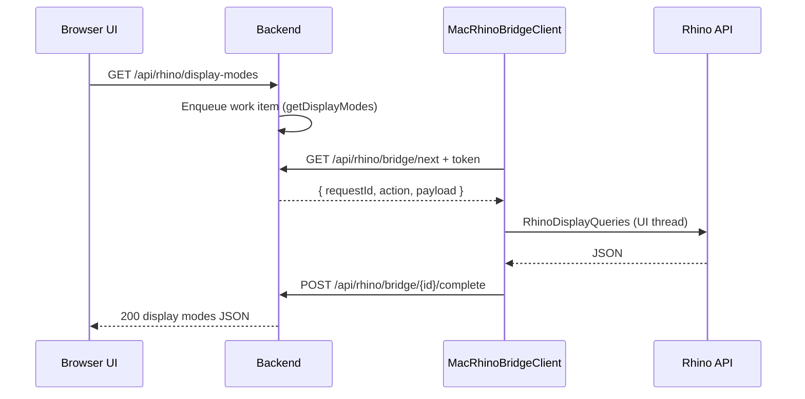

# Cross-Platform Bridge

Rhino Image Studio must run **inside Rhinoceros 8** on Windows and macOS while serving the **same React UI**. The hardest integration problem is: *how does JavaScript call Rhino APIs when there is no WebView2 on macOS?*

This document explains both bridge implementations and the shared abstractions that keep them aligned.

## Requirements

The UI needs synchronous access to:

| Capability | Used for |
|------------|----------|
| `CaptureViewport` | Snapshot active viewport → upload → `captureId` |
| `GetDisplayModes` | Display mode selector in inspector |
| `GetViewports` | Viewport list (future multi-view capture) |
| `GetActiveDisplayMode` | Default mode label |
| `GetApiUrl` | Backend base URL |

On **Windows**, these run in-process via WebView2 COM host objects.

On **macOS**, the UI runs in **Safari/Chrome** (system browser). Rhino runs in a separate process. There is no shared JavaScript host.

## Architecture comparison



| Aspect | Windows | macOS |
|--------|---------|-------|
| UI host | WebView2 panel in Rhino | External browser tab |
| JS → Rhino | `window.chrome.webview.hostObjects.rhino` | HTTP → backend queue → plugin poll |
| Latency | Low (in-process) | Higher (poll interval + HTTP) |
| Auth | Same process — implicit trust | `X-Rhino-Bridge-Token` required |
| Shared code | `Plugin.RhinoCommon` | `Plugin.RhinoCommon` |

## Windows: WebView2 host object

`RhinoBridge` is registered with `CoreWebView2.AddHostObjectToScript("rhino", ...)`.

Critical rule: **all Rhino API calls must run on the Rhino UI thread**. The refactored implementation uses:

```csharp
// RhinoImageStudio.Plugin.RhinoCommon/RhinoUiThread.cs
public static Task<T> RunAsync<T>(Func<T> action)
```

`RunAsync` posts to `RhinoApp.InvokeOnUiThread` and completes a `TaskCompletionSource` — no `.Result` on the UI thread, no fire-and-forget.

Capture flow:

1. `CaptureViewport` → `ViewportCaptureService.CaptureActiveViewport`
2. PNG bytes → `CaptureUploadClient.UploadAsync` → `POST /api/captures`
3. Returns `captureId` string to JavaScript

## macOS: backend-mediated RPC

### Components

| Component | Location | Role |
|-----------|----------|------|
| `RhinoBridgeService` | Backend | Bounded channel queue (max 10), RPC timeout, token validation |
| `RhinoBridgeEndpoints` | Backend | `/api/rhino/bridge/next`, `/complete`, UI-facing `/api/rhino/*` |
| `MacRhinoBridgeClient` | Plugin.Mac | Long-poll loop, executes work on UI thread |
| `BridgeTokenService` | Backend | Generates/persists bridge token |
| `BridgeTokenReader` | Shared | Reads token from `LocalApplicationData/RhinoImageStudio/bridge.token` |

### Sequence: display modes query



### Work item types

Defined in `RhinoImageStudio.Shared/Contracts/RhinoBridgeContracts.cs`:

| Action | Handler |
|--------|---------|
| `captureViewport` | `ViewportCaptureService` + upload |
| `getDisplayModes` | `RhinoDisplayQueries.GetDisplayModesJson` |
| `getViewports` | `RhinoDisplayQueries.GetViewportsJson` |
| `getActiveDisplayMode` | `RhinoDisplayQueries.GetActiveDisplayModeJson` |

### Long-poll contract

**Poll:** `GET /api/rhino/bridge/next?timeoutSeconds=30`

- Header: `X-Rhino-Bridge-Token: <token>`
- Returns `204` if no work within timeout (client loops)
- Returns work item JSON when available

**Complete:** `POST /api/rhino/bridge/{requestId}/complete`

- Header: token required
- Body: `RhinoBridgeCompletion` (success / error / result JSON)

### Status endpoint

`GET /api/rhino/status` returns:

```json
{
  "connected": true,
  "lastSeenUtc": "2026-06-18T12:00:00Z"
}
```

The plugin reads the token from `LocalApplicationData/RhinoImageStudio/bridge.token` — it is **not** exposed over HTTP.

## Frontend: runtime detection

`src/RhinoImageStudio.UI/src/lib/rhino.ts` chooses the bridge explicitly:

```typescript
export type RhinoRuntime = 'webview2' | 'http' | 'none';

export function detectRhinoRuntime(): RhinoRuntime {
  if (window.chrome?.webview?.hostObjects?.rhino)
    return 'webview2';
  if (supportsHttpBridge())
    return 'http';
  return 'none';
}
```

- **WebView2 (Windows):** wraps host object; parses JSON strings from COM where needed
- **HTTP (macOS):** calls `/api/rhino/*` REST endpoints while the macOS plugin polls the bridge queue
- **Windows external browser:** not supported — open Image Studio from the docked Rhino panel (`runtime: 'none'`)

Type definitions: `src/lib/webview.d.ts` extends `Window` for `chrome.webview`.

## Shared: RhinoCommon library

`RhinoImageStudio.Plugin.RhinoCommon` targets **net48** (Windows) and **net8** (macOS):

| Type | Purpose |
|------|---------|
| `ViewportCaptureService` | `ViewCapture.CaptureToBitmap` → PNG bytes |
| `CaptureUploadClient` | Multipart POST to `/api/captures` |
| `RhinoDisplayQueries` | Display modes / viewports JSON |
| `RhinoUiThread` | UI-thread marshaling (Windows) |
| `BackendPortUtilities` | Port discovery for local backend |

Display mode names flow through `DisplayModeMapping` in Shared — one map from enum ↔ Rhino English names.

## Failure modes

| Symptom | Likely cause |
|---------|--------------|
| `503 Rhino bridge is not connected` | macOS plugin not running poll loop — run `ImageStudioStartBackend` |
| `401` on bridge endpoints | Token mismatch — restart backend + plugin |
| Empty display modes on Mac | Fixed in refactor — ensure PR #22+ (real RPC, not stubs) |
| Capture hangs | Queue full (10) or Rhino modal dialog blocking UI thread |

## Smoke test (macOS)

Documented in [macOS plugin setup](../macos.md):

```text
ImageStudioMacStatus
ImageStudioStartBackend
ImageStudioOpen
```

Verify: display mode dropdown populates, capture returns image in studio.

## Further reading

- [Security model — bridge token](security.md#bridge-authentication)
- [Architecture reference — Rhino Bridge endpoints](../api/architecture.md#rhino-bridge)
- [Code quality — bridge findings](code-quality.md#critical-findings-and-fixes)
