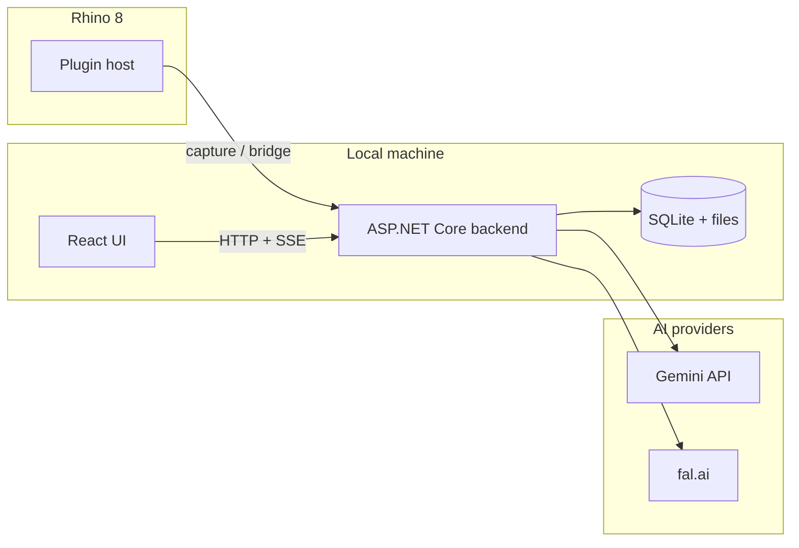
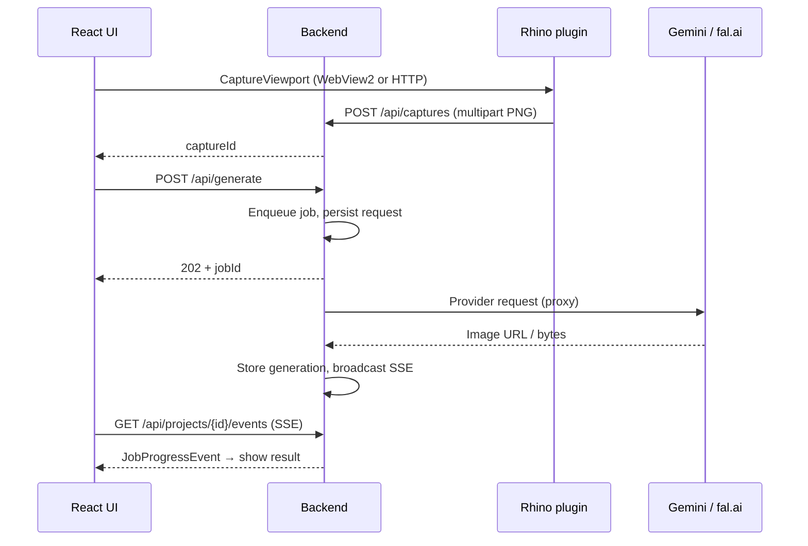

# Project Overview

**Rhino Image Studio** is a cross-platform **Rhinoceros 8** plugin that embeds generative AI in an architectural design workflow. Users capture a 3D viewport, paint inpainting masks, attach reference images, and receive photorealistic renders — without leaving Rhino.

This document is written for **technical reviewers** (recruiters with engineering background, staff engineers, architects). It explains what was built, why the architecture looks the way it does, and which engineering decisions are worth discussing in an interview.

## Problem

Architectural visualization workflows often break context:

1. Export viewport → open Photoshop or a web UI → paste API keys → wait → import back to Rhino.
2. Inpainting tools rarely understand **Rhino display modes** (Shaded, Rendered, Arctic, etc.).
3. Desktop CAD plugins are **platform-specific**; a Windows-only WebView2 bridge does not port to macOS.

The goal was a **local-first, single-window** experience: Rhino viewport in, AI image out, history on disk, keys encrypted in OS storage.

## Solution

A **three-tier hybrid** system:

| Layer | Technology | Responsibility |
|-------|------------|----------------|
| **Plugin (Windows)** | .NET Framework 4.8, WebView2, COM host objects | Docked panel, synchronous Rhino API on UI thread |
| **Plugin (macOS)** | .NET 8, HTTP long-poll bridge | Same UI in browser; Rhino work queued through backend |
| **RhinoCommon shared library** | .NET multi-target (net48 + net8) | One implementation for viewport capture, upload, display queries |
| **Backend** | ASP.NET Core 8, EF Core, SQLite | Job queue, SSE progress, AI proxy, file storage |
| **Frontend** | React 18, TypeScript, Vite, Tailwind | Model-aware inspector, mask canvas, compare slider, gallery |

Both platforms share **one backend**, **one React build** (`Backend/wwwroot`), and **one contract assembly** (`RhinoImageStudio.Shared`).

## Engineering highlights

These are the areas most likely to interest a senior reviewer.

### 1. Cross-platform Rhino bridge

Windows exposes `RhinoBridge` to JavaScript via **WebView2 host objects** (in-process, low latency).

macOS has no equivalent. The plugin implements a **backend-mediated RPC queue**:

- UI calls `/api/rhino/*`
- Backend enqueues work in `RhinoBridgeService`
- Plugin long-polls `/api/rhino/bridge/next` with a **shared secret token**
- Results posted to `/api/rhino/bridge/{id}/complete`

Display modes, viewports, and capture all use the same RPC path — no hardcoded stubs.

→ Full design: [Cross-platform bridge](cross-platform-bridge.md)

### 2. Gemini inpainting without native masks

Gemini image models used here do not accept a separate mask channel. The pipeline sends **two images**:

1. Source render (viewport or generation)
2. **Colored overlay** — each mask region painted in a distinct color with per-layer instructions in the prompt

`PromptBuilder` and `GenerateRequestValidator` enforce model-specific image count limits (Flash: 16, Pro: 14, etc.).

### 3. Model-aware UI

`src/RhinoImageStudio.UI/src/lib/models.ts` is the **single source of truth** for capabilities (aspect ratios, resolutions, max masks, max references). `InspectorPanel` adapts controls per model — backend validates the same rules.

### 4. Local-first security posture

- API keys entered in UI → **ASP.NET Core Data Protection** (with **DPAPI migration** on Windows for existing installs)
- Bridge endpoints require `X-Rhino-Bridge-Token` (file in `%LOCALAPPDATA%/RhinoImageStudio/bridge.token`)
- `StorageService` resolves paths with `Path.GetFullPath` and rejects traversal outside the storage root
- Open repository — no secrets in source control ([SECURITY.md](../../SECURITY.md))

→ Details: [Security model](security.md)

### 5. Code quality program

The codebase went through a structured **audit and refactor** (Thermos review + phased remediation):

- Extracted god files (`Program.cs`, duplicate capture services)
- Fixed SSE pub/sub (per-subscriber channels)
- `FalInputBuilder`, `GenerateRequestValidator`, `JobRequestJson` for consistency
- `RhinoImageStudio.Backend.Tests` + ESLint + CI test jobs

→ Full write-up: [Code quality & audit](code-quality.md)

## Data flow (happy path)

## Tech stack summary

| Area | Choices |
|------|---------|
| Languages | C# (.NET 8 + .NET Framework 4.8), TypeScript |
| UI | React 18, Vite 6, Tailwind 3, Geist Mono |
| Data | SQLite + EF Core, filesystem for images |
| Real-time | Server-Sent Events (`EventBroadcaster`) |
| AI | Google Gemini (generate/refine), fal.ai (Seedream, GPT-Image, Qwen angles, Topaz upscale) |
| CI | GitHub Actions — Windows, macOS, frontend |

## What this demonstrates (interview talking points)

| Topic | Evidence in repo |
|-------|------------------|
| **Cross-platform desktop integration** | `Plugin.RhinoCommon`, `MacRhinoBridgeClient`, `rhino.ts` runtime detection |
| **API design & contracts** | `RhinoImageStudio.Shared/Contracts`, stable Minimal API surface |
| **Async job processing** | `JobQueue`, `JobProcessor`, SSE progress, fal queue polling |
| **Security awareness** | Bridge token, path traversal fix, secret migration, SECURITY.md |
| **Frontend architecture** | Model config SSOT, typed bridge, discriminated unions for selection |
| **Engineering discipline** | Audit docs, unit tests, ESLint, CI matrix, conventional commits |

## Documentation map

| Need | Document |
|------|----------|
| Install & use | [Getting started](../getting-started.md) |
| Full API & schema | [Architecture](../api/architecture.md) |
| Audit & refactor story | [Code quality](code-quality.md) |
| Bridge deep-dive | [Cross-platform bridge](cross-platform-bridge.md) |
| Contribute | [CONTRIBUTING.md](../CONTRIBUTING.md) |

## Status

Active development. Windows and macOS plugins share production code paths; CI builds both solutions on every PR. See [Testing & CI](testing-and-ci.md) for the verification matrix.
