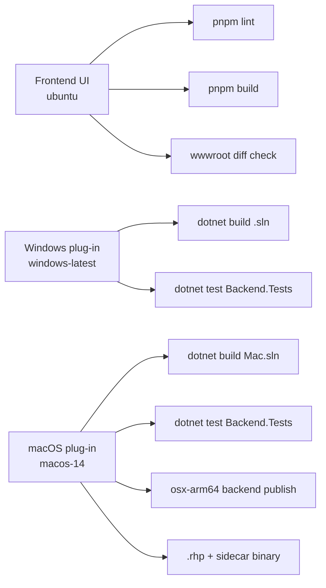

# Testing & CI

How Rhino Image Studio is verified before merge and release.

## CI pipeline (GitHub Actions)

Workflow: `.github/workflows/ci.yml`

Triggers: `push` and `pull_request` to `main` / `master`.



### Job: Frontend UI

| Step | Command | Purpose |
|------|---------|---------|
| Install | `pnpm install --frozen-lockfile` | Reproducible deps |
| Lint | `pnpm run lint` | ESLint + TypeScript rules |
| Build | `pnpm run build` | `tsc` + Vite → `Backend/wwwroot` |
| Verify wwwroot | `git diff --exit-code wwwroot` | Committed assets match build |

### Job: Windows plug-in

| Step | Command | Purpose |
|------|---------|---------|
| Restore / build | `dotnet build RhinoImageStudio.sln` | Backend, Shared, Plugin, RhinoCommon |
| Test | `dotnet test RhinoImageStudio.Backend.Tests` | Unit tests |

Requires **Windows Desktop SDK** (WebView2 plugin project).

### Job: macOS plug-in

| Step | Command | Purpose |
|------|---------|---------|
| Build | `dotnet build RhinoImageStudio.Mac.sln` | Mac plugin + RhinoCommon net8 |
| Test | `dotnet test RhinoImageStudio.Backend.Tests` | Same tests as Windows |
| Publish | `dotnet publish Backend` `osx-arm64` self-contained | Sidecar for `.rhp` bundle |
| Verify | `.rhp` exists + backend binary executable | Release artifact sanity |

## Local development commands

### Backend + tests

```bash
cd src
dotnet build RhinoImageStudio.Mac.sln    # macOS
dotnet build RhinoImageStudio.sln        # Windows
dotnet test RhinoImageStudio.Backend.Tests/RhinoImageStudio.Backend.Tests.csproj
```

### Frontend

```bash
cd src/RhinoImageStudio.UI
pnpm install
pnpm run lint
pnpm run build    # updates ../RhinoImageStudio.Backend/wwwroot
pnpm run dev      # Vite dev server (backend must run separately)
```

### Run backend

```bash
cd src/RhinoImageStudio.Backend
dotnet run    # http://localhost:17532
```

## Unit tests

Project: `src/RhinoImageStudio.Backend.Tests/`

| Test class | Covers |
|------------|--------|
| `DisplayModeMappingTests` | Rhino name ↔ enum parsing, sentinels (`Current`, `viewport`) |
| `FalInputBuilderTests` | Augmented prompt passed to fal payload |

Run:

```bash
dotnet test src/RhinoImageStudio.Backend.Tests --configuration Release
```

### Adding tests

Prefer testing **pure functions** and small services without spinning up `WebApplicationFactory` unless necessary:

- `DisplayModeMapping`, `GenerateRequestValidator`, `FalInputBuilder`
- Shared contract serialization round-trips

Place new files in `RhinoImageStudio.Backend.Tests/` and reference Shared + Backend projects.

## ESLint (frontend)

Config: `src/RhinoImageStudio.UI/eslint.config.js`

| Rule | Level |
|------|-------|
| `@typescript-eslint/no-explicit-any` | warn |
| `@typescript-eslint/no-unused-vars` | error |

```bash
pnpm --dir src/RhinoImageStudio.UI run lint
```

## Manual smoke tests

Automated tests do not launch Rhino. Before release:

### Windows

1. Build plugin → load `.rhp` in Rhino 8
2. `RhinoImageStudio` command → panel opens
3. Capture viewport → generation completes → SSE progress updates
4. Mask inpainting with Gemini model
5. Settings → save Gemini + fal keys → verify encrypted storage

### macOS

1. `scripts/install-mac-plugin.sh`
2. `ImageStudioStartBackend` → `ImageStudioOpen`
3. Display mode list populated (not empty/stub)
4. Capture + generate flow
5. Bridge token: restart backend — plugin reconnects

See [macOS plugin setup](../macos.md) for full steps.

## Release verification matrix

| Check | Windows | macOS |
|-------|---------|-------|
| Solution builds | `RhinoImageStudio.sln` | `RhinoImageStudio.Mac.sln` |
| Unit tests | ✓ | ✓ |
| UI build + wwwroot | ✓ | ✓ |
| Plugin loads in Rhino 8 | Manual | Manual |
| AI generation E2E | Manual | Manual |
| Secret migration (existing DPAPI) | Manual | N/A |

## Related

- [Contributing guide](../CONTRIBUTING.md)
- [Code quality — quality gates](code-quality.md#quality-gates-today)
- [Security pre-merge checks](security.md#pre-merge-checklist)
