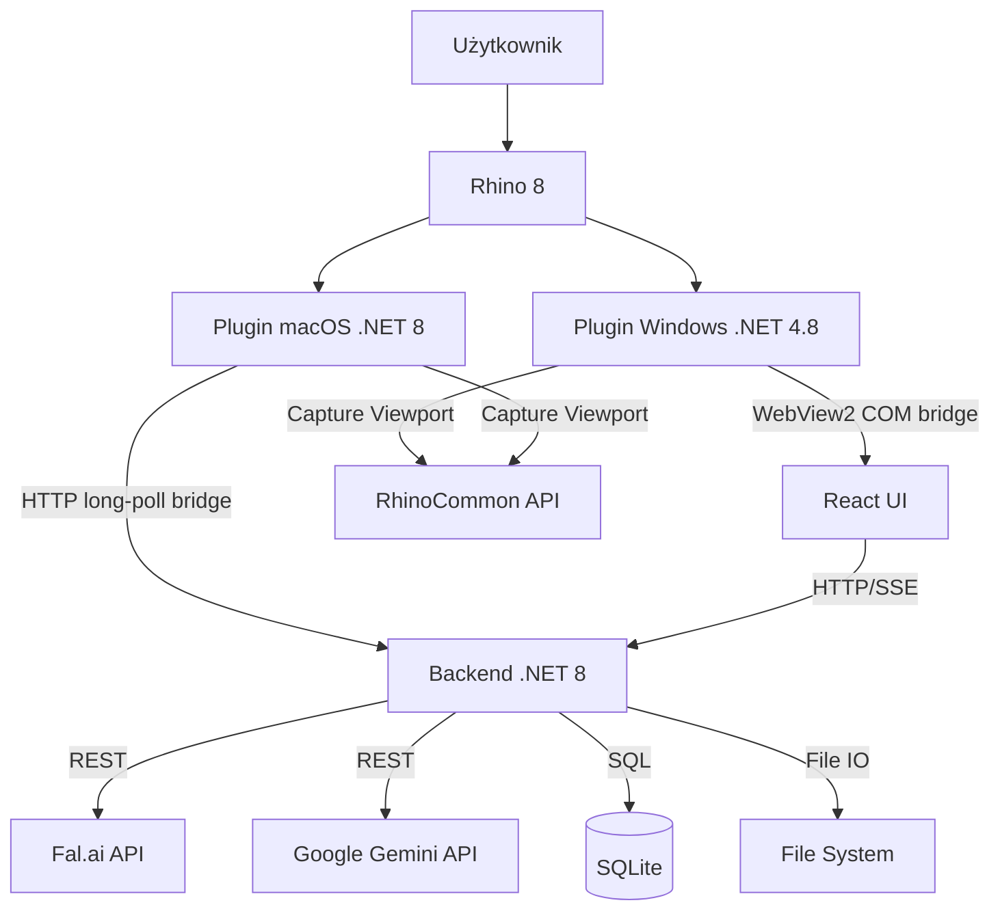

# Architektura Systemu

Rhino Image Studio to system hybrydowy łączący środowisko desktopowe CAD z nowoczesnym stosem webowym (.NET 8 + React). Pluginy Windows i macOS współdzielą backend oraz UI, ale używają różnych implementacji Rhino bridge.

## Diagram Komponentów



## Opis Komponentów

### 1. Pluginy Rhino

#### Plugin Windows (`src/RhinoImageStudio.Plugin`)

- **Technologia**: .NET Framework 4.8.
- **Zadania**:
  - Rejestracja komend (`RhinoImageStudio`).
  - Tworzenie panelu dokowanego.
  - Przechwytywanie obrazu z viewportu (`ViewCapture`).
  - Hosting React UI przez WebView2.

#### Windows RhinoBridge (WebView2 JS Bridge)

Obiekt `RhinoBridge` jest eksponowany do JavaScript przez `WebView2.AddHostObjectToScript`. Umożliwia React UI wywoływanie funkcji Rhino z poziomu przeglądarki.

| Metoda | Sygnatura | Opis |
|--------|-----------|------|
| `GetApiUrl` | `() → string` | URL backendu (`http://localhost:{port}`) |
| `CaptureViewport` | `(sessionId, width, height, displayMode) → string?` | Przechwytuje viewport, uploaduje do backendu, zwraca captureId. `displayMode = "Current"` używa aktualnego trybu viewportu (bez nadpisywania). |
| `GetDisplayModes` | `() → string` (JSON) | Lista trybów wyświetlania Rhino (nazwa + ID) |
| `GetActiveDisplayMode` | `() → string` | Nazwa aktualnego trybu wyświetlania aktywnego viewportu |
| `GetViewports` | `() → string` (JSON) | Lista viewportów (nazwa + isActive) |
| `GetActiveViewportName` | `() → string?` | Nazwa aktywnego viewportu |
| `SetActiveViewport` | `(name) → bool` | Ustawia aktywny viewport po nazwie |
| `ZoomSelected` | `() → void` | Zoom do zaznaczonych obiektów |
| `ZoomExtents` | `() → void` | Zoom do wszystkich obiektów |
| `RunCommand` | `(command) → void` | Wykonuje dowolną komendę Rhino |

Wszystkie metody operujące na Rhino są wewnętrznie dispatched na UI thread (`RhinoApp.InvokeOnUiThread`).

#### Plugin macOS (`src/RhinoImageStudio.Plugin.Mac`)

- **Technologia**: plugin Rhino .NET 8.
- **Komendy**:
  - `ImageStudioMacStatus` — sprawdza, czy plugin się załadował i zapisuje marker statusu.
  - `ImageStudioStartBackend` — uruchamia albo podłącza backend sidecar.
  - `ImageStudioOpen` — uruchamia backend, jeśli trzeba, i otwiera UI w systemowej przeglądarce.
- **Zadania**:
  - Rejestracja komend Rhino dla macOS.
  - Uruchamianie self-contained backend sidecar z zainstalowanego bundle `.rhp`.
  - Utrzymywanie klienta HTTP bridge z Rhino do backendu.
  - Capture aktywnego viewportu na Rhino UI thread.

macOS nie wspiera Windowsowego bridge WebView2/COM. Ścieżka macOS zastępuje `AddHostObjectToScript` przez backend-mediated bridge:

1. React woła endpointy HTTP pod `/api/rhino/*`.
2. `RhinoBridgeService` kolejkuje work items w backendzie.
3. `MacRhinoBridgeClient` long-polluje `/api/rhino/bridge/next` z procesu Rhino.
4. Plugin wykonuje pracę RhinoCommon na Rhino UI thread.
5. Captures są uploadowane przez istniejący endpoint `/api/captures`.

### 2. Backend (`src/RhinoImageStudio.Backend`)
- **Technologia**: ASP.NET Core 8.0.
- **Rola**: "Mózg" operacji niezależny od Rhino.
- **Zadania**:
  - Serwowanie plików statycznych UI (React).
  - Proxy do API fal.ai (ukrywanie klucza API).
  - Kolejkowanie zadań (Jobs).
  - Baza danych (Entity Framework + SQLite) - historia sesji, promptów.

#### Struktura backendu po refaktorze

- `Program.cs` pełni rolę bootstrapu (DI, middleware, mapowanie endpoint groups).
- 37 endpointów wyekstrahowanych z `Program.cs` do 7 plików w katalogu `Endpoints/`:
  - `CaptureEndpoints.cs`, `ConfigEndpoints.cs`, `EventEndpoints.cs`,
  - `GenerationEndpoints.cs`, `ImageEndpoints.cs`, `JobEndpoints.cs`, `ProjectEndpoints.cs`.
- Mapowanie modeli na DTO jest scentralizowane w `MappingExtensions.cs` (`ToDto()`).
- Kontrakt API został zachowany: trasy, kształty DTO i format SSE pozostały kompatybilne.

#### Kluczowe usprawnienia techniczne

- **SSE pub/sub**: każdy subscriber dostaje własny channel (brak "gubienia" eventów przy wielu klientach).
- **HttpClient lifecycle**: pobieranie obrazów używa `IHttpClientFactory` (`ImageDownloader`).
- **Resilience**: klienci HTTP mają `AddStandardResilienceHandler()`.
- **PromptBuilder**: wyekstrahowany serwis do budowania promptów z maskami/overlay (shared między Generate i Refine).
- **JobProcessor**: obsługuje modele Seedream i GPT-Image via `FalAiClient.RunSyncAsync` z queue polling i URL-based routing.
- **Storage security**: `StorageService.GetAbsolutePath()` waliduje ścieżkę po `Path.GetFullPath` (ochrona przed path traversal).
- **Thumbnail pipeline**: miniatury są faktycznie resize'owane do max 256 px (ImageSharp).
- **Konfiguracja przez IOptions**: `StorageService` i `DpapiSecretStorage` korzystają z `StorageOptions`/`SecretStorageOptions`.
- **Cross-platform secret storage**: `DataProtectionSecretStorage` zastępuje DPAPI-only encryption dla kompatybilności .NET 8/macOS.
- **Rhino bridge queue**: `RhinoBridgeService` koordynuje work items UI-to-Rhino na macOS.

### 3. Frontend UI (`src/RhinoImageStudio.UI`)
- **Technologia**: React 18, Vite 5, TypeScript 5.4, Tailwind CSS 3.4.
- **Package manager**: pnpm (z `node-linker=hoisted`).
- **Typografia**: Geist Mono (jedyna czcionka — monospace, hierarchia przez wagi i rozmiary).
- **Zadania**:
  - Interfejs użytkownika.
  - Wizualizacja postępu.
  - Edytory parametrów.

## Design System

### Mono-Theme

Aplikacja używa achromatycznej palety Mono-Theme z akcentem teal. Ostry, techniczny styl (zero border-radius, czcionka monospace). Pełne wsparcie Light/Dark mode.

### Paleta Kolorów

| Token | Light Mode | Dark Mode | Użycie |
|-------|------------|-----------|--------|
| `text` | `#0F0F0F` | `#D1D1D1` | Główny tekst |
| `background` | `#ededed` | `#262626` | Tło aplikacji |
| `primary` | `#586B71` | `#90A3A9` | Nagłówki, CTA (Teal) |
| `secondary` | `#757575` | `#999999` | Tekst drugorzędny |
| `accent` | `#0F0F0F` | `#D1D1D1` | Akcenty (mocny kontrast) |
| `panel-bg` | `#ededed` | `#2C2C2C` | Panele boczne |
| `card-bg` | `#ededed` | `#2C2C2C` | Karty, overlay |
| `card-hover` | `#E5E5E5` | `#363636` | Hover na kartach |
| `border` | `#D6D6D6` | `#353535` | Obramowania |
| `danger` | `#757575` | `#999999` | Destrukcyjne akcje (achromatyczne) |
| `success` | `#757575` | `#999999` | Sukces (achromatyczne) |
| `warning` | `#757575` | `#999999` | Ostrzeżenia (achromatyczne) |
| `info` | `#586B71` | `#90A3A9` | Informacje systemowe (teal) |

Dodatkowe tokeny utility: `--radius: 0rem` (ostre krawędzie, zero zaokrągleń).

### Typografia

**Czcionka:** Geist Mono (wagi: 100–900, variable font)
**CSS variable:** `--font-sans: 'Geist Mono', ui-monospace, monospace`
**Hierarchia:** font-weight + font-size (monospace, bez mieszania fontów)

| Rozmiar | Wartość |
|---------|---------|
| `micro` / `xs` | 0.625rem |
| `sm` | 0.750rem |
| `base` | 1rem |
| `lg` | 1.125rem |
| `xl` | 1.333rem |
| `2xl` | 1.777rem |
| `3xl` | 2.369rem |
| `4xl` | 3.158rem |
| `5xl` | 4.210rem |

### Użycie w kodzie

```tsx
// Tailwind classes (Mono-Theme)
<div className="bg-background text-text border-border">
<button className="bg-primary text-background hover:bg-primary/90">
  CTA Button
</button>
<div className="bg-card hover:bg-card-hover">Card</div>
```

Pełna specyfikacja w sekcji Design System powyżej oraz w `CLAUDE.md`.

## Konfiguracja Modeli AI

Każdy model AI ma własną konfigurację dostępnych opcji. System jest **model-aware** - UI automatycznie dostosowuje dostępne opcje do wybranego modelu.

### Struktura konfiguracji (`models.ts`)

```typescript
interface ModelInfo {
  id: string;                          // ID modelu (np. "gemini-3.1-flash-image-preview")
  provider: 'fal' | 'gemini';         // Dostawca API
  name: string;                        // Pełna nazwa wyświetlana
  shortName: string;                   // Krótka nazwa (np. "gemini-flash")
  description: string;                 // Opis modelu
  capabilities: ModelCapabilities;     // Flagi wspieranych funkcji
  aspectRatios?: AspectRatioOption[];  // Dostępne proporcje obrazu
  resolutions?: ResolutionOption[];    // Dostępne rozdzielczości
  maxReferences?: number;              // Max obrazów referencyjnych
  maxMaskLayers?: number;              // Max warstw masek inpainting
  maxTotalImages?: number;             // Max obrazów w jednym request (source + overlay + refs)
  qualityOptions?: { value: string; label: string }[];   // Opcje jakości (GPT-Image)
  fidelityOptions?: { value: string; label: string }[];  // Opcje fidelity (GPT-Image)
}

interface ModelCapabilities {
  supportsNegativePrompt: boolean;
  supportsSeed: boolean;
  supportsAspectRatio: boolean;
  supportsNumImages: boolean;
  supportsStrength: boolean;           // Image-to-image / refine
  supportsReferences: boolean;         // Obrazy referencyjne
  supportsMasks: boolean;              // Maski inpainting
}
```

### Dostępne Modele

| Model | Provider | Rozdzielczości | AR | Referencje | Maski | Domyślny dla |
|-------|----------|---------------|-----|------------|-------|-------------|
| **Gemini 3.1 Flash** | Gemini | 0.5K, 1K, 2K, 4K | 14 ratios (rozszerzone) | Max 14 | Max 2 | Generate, Refine |
| **Gemini 3 Pro** | Gemini | 1K, 2K, 4K | 10 ratios (standard) | Max 11 | Max 8 | - |
| **Seedream v5 Lite** | fal.ai | Auto 2K/3K + presety | 8 presetów | Max 9 | - | - |
| **GPT-Image 1.5** | fal.ai | Pixel-based | 4 opcje | Max 4 | - | - |
| **Qwen Multi-Angle** | fal.ai | - | - | - | - | Multi-angle |
| **Topaz Upscale** | fal.ai | - | - | - | - | Upscale |

**Gemini 3.1 Flash** (`gemini-3.1-flash-image-preview`) — domyślny model (tańszy, szybszy). Obsługuje rozszerzone aspect ratios (w tym 1:4, 1:8, 4:1, 8:1) i rozdzielczości od 0.5K do 4K. Max 16 obrazów w jednym request.
**Gemini 3 Pro** (`gemini-3-pro-image-preview`) — wyższa jakość, standardowe AR (10 ratios). Max 14 obrazów per request.
**Seedream v5 Lite** (`fal-ai/bytedance/seedream/v5/lite/edit`) — ByteDance, edycja obrazów do 3K. Obsługuje referencje (max 9), presety rozmiarów (Auto 2K/3K, square, portrait, landscape).
**GPT-Image 1.5** (`fal-ai/gpt-image-1.5/edit`) — OpenAI, edycja z kontrolą quality/fidelity. Obsługuje referencje (max 4), rozmiary pixel-based (1024x1024, 1536x1024, 1024x1536).

> **Uwaga:** Backend (`GeminiClient.cs`) warunkuje parametr `imageSize` — wysyłany tylko dla modeli Pro. Flash nie wspiera tego parametru.

### Reference Images

Cztery modele (Gemini 3.1 Flash, Gemini 3 Pro, Seedream v5 Lite, GPT-Image 1.5) obsługują **obrazy referencyjne** — dodatkowe obrazy uploadowane z dysku, które model AI wykorzystuje jako kontekst wizualny (np. materiały, obiekty, styl).

- Upload: `POST /api/projects/{projectId}/references` (multipart, max 10MB/plik)
- Lista: `GET /api/projects/{projectId}/references`
- Usuwanie: `DELETE /api/references/{id}`
- Limit: max 4 referencje per projekt (walidacja backend), max per model wg `maxReferences` w `models.ts`
- Przekazywanie: jako `inline_data` parts[] w Gemini API request; jako `image_url` w fal.ai request
- UI: panel pod canvasem z miniaturkami, widoczny tylko dla modeli wspierających referencje

### Viewport Capture Synchronizacja

Capture automatycznie używa wymiarów zgodnych z wybranymi ustawieniami w edytorze:
- `InspectorPanel` → ustawienia AR/Resolution → `StudioPage` → `handleCapture()`
- Funkcja `calculateDimensions()` przelicza piksele na podstawie AR i Resolution

## Przepływ Danych (Data Flow)

1. **Capture**: Plugin przechwytuje bitmapę (wymiary z AR/Resolution) -> wysyła POST do Backendu.
2. **Job**: Backend tworzy zadanie, zapisuje obraz na dysku, dodaje wpis do DB.
3. **Generate**: Backend wysyła request do fal.ai/Gemini. Frontend odpytuje (lub dostaje SSE) o status.
4. **Result**: API zwraca URL obrazu -> Backend go pobiera i zapisuje lokalnie -> Frontend wyświetla.

## Endpointy API (pełna lista)

Wszystkie endpointy pod prefixem `/api` (z wyjątkiem `/images/` i fallback SPA).

### Projects

| Metoda | Endpoint | Opis |
|--------|----------|------|
| GET | `/api/projects` | Lista projektów (sortowanie: pinned, updatedAt) |
| GET | `/api/projects/{id}` | Szczegóły projektu |
| POST | `/api/projects` | Utwórz projekt (`CreateProjectRequest`) |
| PUT | `/api/projects/{id}` | Aktualizuj projekt (`UpdateProjectRequest`) |
| DELETE | `/api/projects/{id}` | Usuń projekt (cascade: captures, generations, references + pliki) |

### Captures

| Metoda | Endpoint | Opis |
|--------|----------|------|
| GET | `/api/projects/{projectId}/captures` | Lista captures projektu |
| POST | `/api/captures` | Upload capture (multipart: image, projectId, width, height, displayMode, viewName) |
| DELETE | `/api/captures/{id}` | Usuń capture (+ pliki) |

### Rhino Bridge

Te endpointy obsługują backend-mediated Rhino bridge dla macOS. Używa ich również React fallback bridge, gdy WebView2 host objects nie są dostępne.

| Metoda | Endpoint | Opis |
|--------|----------|------|
| GET | `/api/rhino/status` | Status połączenia bridge (`connected`, `lastSeenUtc`) |
| GET | `/api/rhino/display-modes` | Tryby display mode wystawiane do UI, gdy Rhino jest podłączone |
| GET | `/api/rhino/viewports` | Placeholder listy viewportów dla HTTP bridge |
| GET | `/api/rhino/active-display-mode` | Placeholder aktywnego display mode dla HTTP bridge |
| POST | `/api/rhino/capture` | Kolejkuje viewport capture i zwraca `captureId` |
| GET | `/api/rhino/bridge/next` | Long-poll endpoint używany przez plugin macOS |
| POST | `/api/rhino/bridge/{requestId}/complete` | Kończy zakolejkowany Rhino work item |

### Generations

| Metoda | Endpoint | Opis |
|--------|----------|------|
| GET | `/api/projects/{projectId}/generations` | Lista aktywnych generacji (bez archived) |
| GET | `/api/projects/{projectId}/generations/archived` | Lista zarchiwizowanych generacji |
| GET | `/api/generations` | Globalna lista (`?limit=50&offset=0`) |
| GET | `/api/generations/{id}` | Szczegóły generacji |

### Archiwizacja

| Metoda | Endpoint | Opis |
|--------|----------|------|
| DELETE | `/api/generations/{id}` | Archiwizuj (soft-delete: IsArchived=true) |
| PUT | `/api/generations/{id}/restore` | Przywróć z archiwum |
| DELETE | `/api/generations/{id}/permanent` | Usuń trwale (wymaga archived, kasuje pliki + rekord) |

### Diagnostyka

| Metoda | Endpoint | Opis |
|--------|----------|------|
| GET | `/api/generations/{id}/debug` | Debug info (sanitized request, augmented prompt, maski jako rozmiar) |
| GET | `/api/generations/{id}/masks` | Mask data (pełne base64 PNG + instrukcje z Job.RequestJson) |
| GET | `/api/generations/{id}/masks/overlay` | Overlay image (binary PNG — kolorowy overlay masek) |
| GET | `/api/generations/{id}/masks/{index}/image` | Pojedyncza maska B&W (binary PNG, legacy format) |

### References

| Metoda | Endpoint | Opis |
|--------|----------|------|
| GET | `/api/projects/{projectId}/references` | Lista referencji projektu |
| POST | `/api/projects/{projectId}/references` | Upload referencji (multipart: image, max 10MB, max 4/projekt) |
| DELETE | `/api/references/{id}` | Usuń referencję (+ pliki) |

### Pipeline (akcje AI)

| Metoda | Endpoint | Opis |
|--------|----------|------|
| POST | `/api/generate` | Generacja obrazu (`GenerateRequest` — z maskami/referencjami) |
| POST | `/api/refine` | Refinement (`RefineRequest`) |
| POST | `/api/multi-angle` | Multi-angle Qwen (`MultiAngleRequest`) |
| POST | `/api/upscale` | Upscale Topaz (`UpscaleRequest`) |

Wszystkie zwracają `202 Accepted` z `JobDto`.

### Jobs

| Metoda | Endpoint | Opis |
|--------|----------|------|
| GET | `/api/projects/{projectId}/jobs` | Lista zadań projektu |
| POST | `/api/jobs/{id}/cancel` | Anuluj zadanie (próbuje cancel fal.ai, ustawia Canceled) |

### Config

| Metoda | Endpoint | Opis |
|--------|----------|------|
| GET | `/api/config` | Aktualna konfiguracja (`ConfigDto`) |
| POST | `/api/config/api-key` | Legacy: ustaw klucz fal.ai (`SetApiKeyRequest`) |
| POST | `/api/config/gemini-api-key` | Ustaw klucz Gemini (`SetGeminiApiKeyRequest`) |
| POST | `/api/config/fal-api-key` | Ustaw klucz fal.ai (`SetFalApiKeyRequest`) |
| POST | `/api/config/verify-gemini-key` | Weryfikuje klucz Gemini API (test call do modeli) |
| DELETE | `/api/config/secrets/gemini` | Usuwa klucz Gemini API z DPAPI |

> Frontend client (`src/RhinoImageStudio.UI/src/lib/api.ts`) używa aktywnie endpointów `gemini-api-key` i `fal-api-key`; metoda legacy `setApiKey` została usunięta z kodu UI.

### Events (SSE)

| Metoda | Endpoint | Opis |
|--------|----------|------|
| GET | `/api/events` | Globalny strumień SSE (wszystkie eventy, per-subscriber channel) |
| GET | `/api/projects/{projectId}/events` | Strumień SSE filtrowany po projekcie (per-subscriber channel) |

Content-Type: `text/event-stream`. Dane jako JSON w formacie `data: {...}\n\n`.

### Inne

| Metoda | Endpoint | Opis |
|--------|----------|------|
| GET | `/api/health` | Health check (`HealthResponse`: `status`, `timestamp`) |
| GET | `/images/{**path}` | Serwowanie plików statycznych (captures, thumbnails, generacje) |

### Główne kontrakty (DTOs)

Kontrakty zdefiniowane w `src/RhinoImageStudio.Shared/Contracts/Contracts.cs`.

#### GenerateRequest (najważniejszy — obsługuje maski i referencje)

```typescript
{
  projectId: Guid;
  prompt: string;
  sourceCaptureId?: Guid;
  parentGenerationId?: Guid;
  model?: string;              // "gemini-3.1-flash-image-preview" | "gemini-3-pro-image-preview" | "fal-ai/bytedance/seedream/v5/lite/edit" | "fal-ai/gpt-image-1.5/edit"
  aspectRatio?: string;        // "1:1", "16:9", ...
  resolution?: string;         // "1K", "2K", "4K"
  numImages: number;           // default 1
  outputFormat?: string;       // "png" | "jpeg"
  referenceImageIds?: Guid[];
  maskLayers?: MaskLayerData[];     // legacy B&W format
  maskPayload?: MaskPayloadData;    // nowy overlay format
  quality?: string;                 // opcja jakości (GPT-Image: "low" | "medium" | "high")
  inputFidelity?: string;           // opcja fidelity (GPT-Image: "low" | "medium" | "high")
}

// MaskPayloadData (overlay):
{ overlayImageBase64: string; layers: MaskOverlayLayerData[] }
// MaskOverlayLayerData:
{ color: string; colorName: string; instruction: string }
// MaskLayerData (legacy):
{ maskImageBase64: string; instruction: string }
```

#### GenerationDto (odpowiedź — dane generacji)

```typescript
{
  id: Guid;
  projectId: Guid;
  parentGenerationId?: Guid;
  sourceCaptureId?: Guid;
  stage: JobType;              // Generate | Refine | MultiAngle | Upscale
  prompt?: string;
  imageUrl?: string;
  thumbnailUrl?: string;
  width?: number;
  height?: number;
  azimuth?: number;
  elevation?: number;
  zoom?: number;
  modelId?: string;
  parametersJson?: string;     // JSON: {"aspectRatio":"16:9","resolution":"1K",...}
  createdAt: DateTime;
  isArchived: boolean;
  archivedAt?: DateTime;
  projectName?: string;        // nazwa projektu (dostępna w GET /api/generations)
}
```

#### ProjectDto

```typescript
{
  id: Guid;
  name: string;
  description?: string;
  createdAt: DateTime;
  updatedAt: DateTime;
  isPinned: boolean;
  captureCount: number;
  generationCount: number;     // tylko aktywne (nie archived)
  lastThumbnailUrl?: string;
}
```

#### HealthResponse

```typescript
{
  status: string;
  timestamp: DateTime;
}
```

#### CaptureDto

```typescript
{
  id: Guid;
  projectId: Guid;
  imageUrl: string;
  thumbnailUrl?: string;
  width: number;
  height: number;
  displayModeName: string;     // nazwa trybu użytego przy przechwyceniu (np. "Shaded", "Wireframe", "Rendered")
  viewName?: string;
  createdAt: DateTime;
}
```

#### JobDto + JobProgressEvent

```typescript
// JobDto (stan zadania):
{
  id: Guid;
  projectId: Guid;
  type: JobType;               // Generate | Refine | MultiAngle | Upscale
  status: JobStatus;           // Queued | Running | Succeeded | Failed | Canceled
  progress: number;            // 0-100
  progressMessage?: string;
  errorMessage?: string;
  resultId?: Guid;             // ID generacji po zakończeniu
  createdAt: DateTime;
  startedAt?: DateTime;
  completedAt?: DateTime;
}

// JobProgressEvent (SSE event):
{
  jobId: Guid;
  status: JobStatus;
  progress: number;
  message?: string;
  resultId?: Guid;
}
```

#### ConfigDto

```typescript
{
  hasFalApiKey: boolean;
  hasGeminiApiKey: boolean;
  dataPath: string;
  backendPort: number;
  defaultProvider: string;     // "gemini" | "fal"
}
```

## Struktura Bazy Danych

Dane przechowywane w SQLite via Entity Framework Core. Plik bazy: `%LOCALAPPDATA%/RhinoImageStudio/data/rhinoimagestudio.db`.

### Tabele

| Tabela | Kolumny | Opis |
|--------|---------|------|
| **Projects** | `Id`, `Name`, `IsPinned`, `CreatedAt`, `UpdatedAt` | Kontener na pracę użytkownika |
| **Captures** | `Id`, `ProjectId`, `ViewName`, `Width`, `Height`, `ImageUrl`, `ThumbnailUrl`, `CreatedAt`, `CameraJson`, `StyleName` | Przechwycony obraz z viewportu Rhino |
| **Generations** | `Id`, `ProjectId`, `Prompt`, `ImageUrl`, `ThumbnailUrl`, `Width`, `Height`, `ParametersJson`, `IsArchived`, `ArchivedAt`, `ParentGenerationId`, `CreatedAt` | Wynik operacji AI (soft-delete via `IsArchived`) |
| **ReferenceImages** | `Id`, `ProjectId`, `OriginalFileName`, `FilePath`, `ThumbnailPath`, `CreatedAt` | Obrazy referencyjne uploadowane przez użytkownika |
| **Jobs** | `Id`, `ProjectId`, `Type`, `Status`, `Progress`, `ResultGenerationId`, `ErrorMessage`, `CreatedAt`, `CompletedAt`, `ParametersJson` | Zadanie w kolejce przetwarzania |

Indeks kompozytowy `(ProjectId, IsArchived)` na tabeli Generations optymalizuje filtrowanie aktywnych/zarchiwizowanych generacji.

## Frontend API Client (UI)

Frontend używa scentralizowanego klienta `api.ts` z parserem błędów `apiError()`, który odczytuje `error/message/details` z odpowiedzi backendu i przekazuje je do toastów UI.

Najważniejsze zmiany po refaktorze:
- Klient projektów mapuje `ProjectDto.lastThumbnailUrl` do pola podglądu używanego w kartach.
- Hook `useJobs` ładuje stan początkowy przez `GET /api/projects/{projectId}/jobs` (zamiast surowego `fetch`).
- Selekcja elementu w Studio jest typowana jako discriminated union (`SelectedItem`) zamiast duck-typingu.

Główne encje:
- **Project**: Kontener na pracę użytkownika.
- **Capture**: Przechwycony obraz z viewportu Rhino.
- **Generation**: Pojedyncza operacja AI (Prompt + Parametry + Wynik). Pola `IsArchived` (bool) i `ArchivedAt` (DateTime?) obsługują soft-delete.
- **ReferenceImage**: Obraz referencyjny uploadowany przez użytkownika (max 4/projekt).
- **Job**: Zadanie w kolejce przetwarzania (Generate, Refine, MultiAngle, Upscale).

### Archiwizacja generacji

Generacje obsługują soft-delete (archiwizację) — nie są trwale usuwane, a oznaczane flagą `IsArchived = true`. Endpointy list generacji automatycznie filtrują zarchiwizowane wpisy. Trwałe usunięcie (z plikami) wymaga wcześniejszej archiwizacji.

Indeks kompozytowy `(ProjectId, IsArchived)` optymalizuje zapytania filtrowań.

### Endpointy archiwizacji

| Endpoint | Metoda | Opis |
|----------|--------|------|
| `DELETE /api/generations/{id}` | Soft-delete | IsArchived=true, ArchivedAt=now |
| `PUT /api/generations/{id}/restore` | Przywróć | IsArchived=false, ArchivedAt=null |
| `DELETE /api/generations/{id}/permanent` | Hard-delete | Wymaga archived, usuwa pliki + rekord |
| `GET /api/projects/{id}/generations/archived` | Lista | Tylko zarchiwizowane, sortowane po ArchivedAt |

### Endpointy diagnostyczne

Endpoint `/debug` zwraca uproszczone dane (maski jako `[PNG, ~XKB]`). Endpoint `/masks` zwraca pełne base64 PNG — używany do rekonstrukcji masek na canvas.
